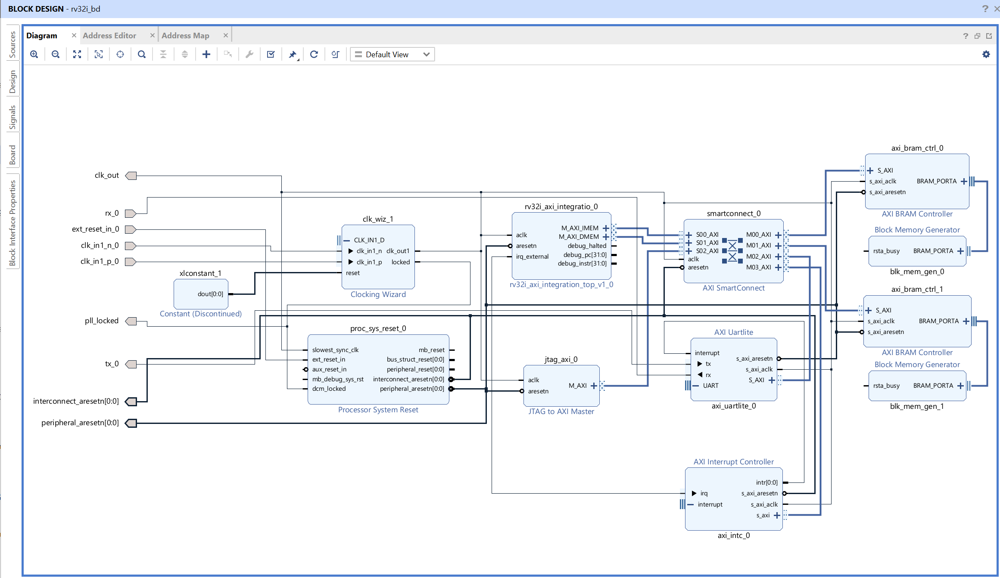
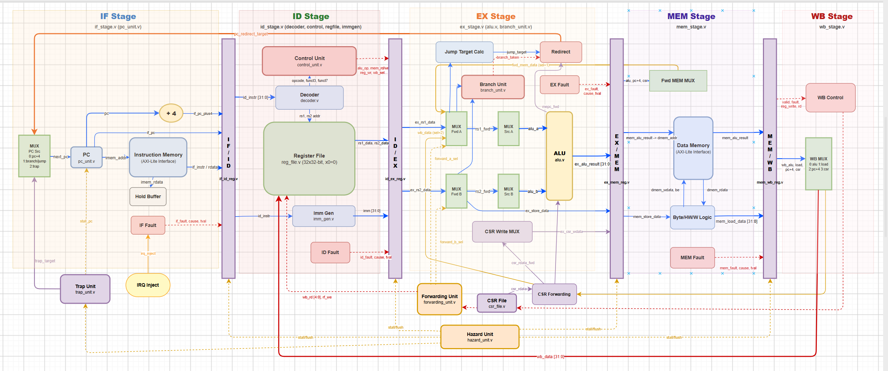
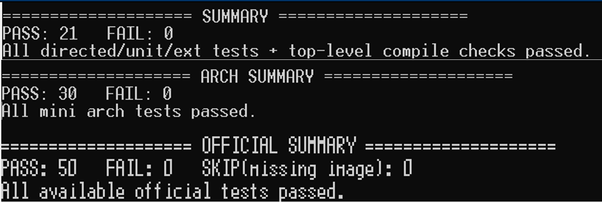
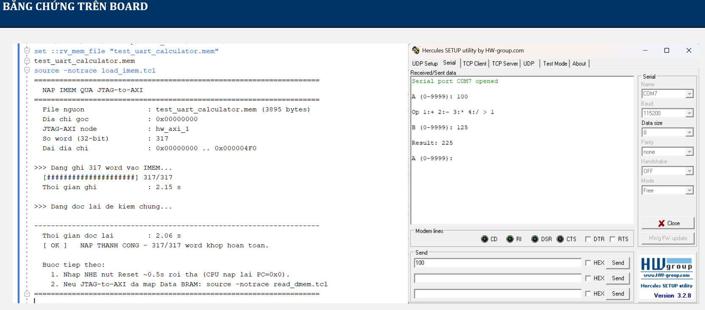
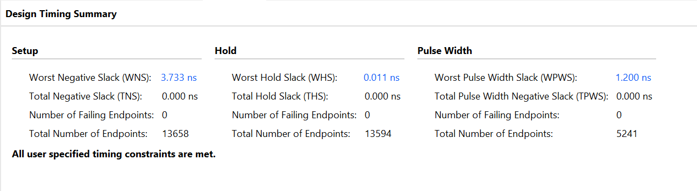

# Thiết Kế & Kiểm Chứng CPU RISC-V RV32I Trên FPGA AMD ZCU106

<p align="center">
  <b>Ngôn ngữ / Language:</b>
  <a href="README.md"><b>🇻🇳 Tiếng Việt</b></a> |
  <a href="README_EN.md"><b>🇬🇧 English</b></a>
</p>

<p align="center">
  
  
  
  
  
  
</p>

---

## 📌 1. Giới thiệu dự án

Dự án hiện thực một bộ xử lý **RISC-V RV32I** hoàn chỉnh bằng Verilog HDL và tích hợp thành hệ thống **System-on-Chip (SoC)** chạy thực tế trên board đánh giá **AMD ZCU106** (Zynq UltraScale+ `xczu7ev-ffvc1156-2-e`).

Thiết kế tập trung vào tính toàn vẹn cấu trúc phần cứng và độ chuẩn xác kiến trúc:
- Pipeline 5 tầng in-order (IF – ID – EX – MEM – WB) theo kiến trúc Harvard độc lập.
- Hỗ trợ đầy đủ tập lệnh **RV32I Base Integer**, phần mở rộng **Zicsr** và tập con **Machine-mode Privileged** (ECALL, EBREAK, MRET).
- Điểm commit duy nhất tại tầng **Writeback (WB)** đảm bảo tính chính xác tuyệt đối của ngoại lệ (precise exceptions) và trạng thái kiến trúc.
- Bộ điều khiển giao tiếp bộ nhớ thông qua hai adapter **AXI4-Lite** độc lập cho Bus lệnh (I-AXI) và Bus dữ liệu (D-AXI).
- Hệ thống nạp firmware trực tiếp vào Instruction BRAM qua **JTAG-to-AXI** bằng script Tcl trong Vivado, không cần build lại bitstream.

---

## 🏛️ 2. Kiến trúc hệ thống SoC

Hệ thống SoC trên FPGA được tích hợp qua AMD Vivado Block Design (`rv32i_bd`), kết nối core với hệ thống nhớ và ngoại vi thông qua interconnect **AMD SmartConnect** điều phối 3 AXI Masters:

<p align="center">
  
  <br>
  <em>Hình 1: Sơ đồ khối hệ thống SoC trên FPGA AMD ZCU106 (Vivado Block Design)</em>
</p>

### Thành phần chính của SoC:
- **Core Subsystem (`rv32i_axi_integration_top`)**: Đóng gói lõi xử lý `rv32i_core` cùng 2 adapter master AXI4-Lite (`M_AXI_IMEM` và `M_AXI_DMEM`).
- **AMD AXI SmartConnect**: Điều phối truy cập giữa 3 AXI Masters (I-AXI, D-AXI, JTAG-to-AXI) tới các Slave ngoại vi.
- **Instruction BRAM (IMEM)**: Dung lượng 8 KiB (`0x0000_0000`), lưu mã máy chương trình và trap handler.
- **Data BRAM (DMEM)**: Dung lượng 8 KiB (`0x0000_2000`), lưu biến toàn cục, stack, buffer và marker debug.
- **AXI UARTLite**: Base address `0x0004_0000`, baud rate 115200 8N1, giao tiếp UART console và phát tín hiệu ngắt.
- **AXI INTC (Interrupt Controller)**: Base address `0x0005_0000`, tiếp nhận ngắt từ UARTLite và chuyển tiếp ngắt ngoài (`irq_external`) tới Core.
- **Clocking Wizard & Reset**: Nhận clock nguồn 125 MHz từ board ZCU106 sinh clock hệ thống 100 MHz; quản lý reset đồng bộ qua IP `proc_sys_reset_0`.

### Bản đồ địa chỉ (Memory Map):

| Vùng nhớ / Ngoại vi | Dải địa chỉ | Kích thước | Mô tả |
|---|---|---|---|
| **Instruction BRAM (IMEM)** | `0x0000_0000 – 0x0000_1FFF` | 8 KiB | Chương trình chính và trap handler |
| **Data BRAM (DMEM)** | `0x0000_2000 – 0x0000_3FFF` | 8 KiB | Biến toàn cục, stack, buffer và marker debug |
| **AXI UARTLite** | `0x0004_0000 – 0x0004_FFFF` | 64 KiB | Giao tiếp Serial RX/TX và nguồn ngắt |
| **AXI Interrupt Controller** | `0x0005_0000 – 0x0005_FFFF` | 64 KiB | Enable / Pending / Acknowledge interrupt |

---

## ⚙️ 3. Vi kiến trúc Core RV32I

Lõi vi xử lý `rv32i_core` được thiết kế theo mô hình pipeline 5 tầng kinh điển:

<p align="center">
  
  <br>
  <em>Hình 2: Sơ đồ chi tiết vi kiến trúc 5 tầng pipeline (IF – ID – EX – MEM – WB)</em>
</p>

### Đặc điểm thiết kế cốt lõi:
1. **Instruction Fetch (IF)**:
   - Quản lý thanh ghi `PC`, hỗ trợ bộ đệm giữ lệnh (`hold buffer`) và logic huỷ yêu cầu nạp lệnh (`fetch cancellation`) khi branch/trap chuyển hướng.
   - Cơ chế back-pressure: Toàn bộ pipeline tạm dừng một cách an toàn khi bộ nhớ có độ trễ thay đổi.
2. **Instruction Decode (ID)**:
   - Module `decoder` và `imm_gen` giải mã opcode, tách trường thanh ghi và sinh hằng số mở rộng dấu cho 5 định dạng lệnh (I, S, B, U, J).
   - Bộ thanh ghi `reg_file`: 32 thanh ghi 32-bit xây dựng bằng Flip-Flop, hỗ trợ 2 cổng đọc bất đồng bộ và 1 cổng ghi đồng bộ, cho phép bypass nội chu kỳ (đọc được giá trị vừa ghi trong cùng chu kỳ). Thanh ghi `x0` cố định bằng 0.
   - Phát hiện các lệnh không hợp lệ (`illegal instruction`), `ECALL`, `EBREAK` ngay tại tầng này.
3. **Execute (EX)**:
   - Đơn vị số học logic `alu`: Hiện thực 11 phép tính cơ bản (ADD, SUB, SLL, SLT, SLTU, XOR, SRL, SRA, OR, AND). Phép SUB, SLT, SLTU dùng chung bộ cộng tối ưu.
   - Phân giải nhánh `branch_unit`: Đánh giá đủ 6 điều kiện rẽ nhánh (BEQ, BNE, BLT, BGE, BLTU, BGEU) và tính địa chỉ đích tại EX.
   - Chuyển tiếp dữ liệu (`forwarding_unit`): Bypass dữ liệu trực tiếp từ tầng MEM và WB về 2 toán hạng ngõ vào EX, ưu tiên giá trị mới nhất tại MEM.
   - Giải quyết xung đột (`hazard_unit`): Tự động phát hiện phụ thuộc dữ liệu kiểu `load-use` và chèn đúng 1 chu kỳ bong bóng (`stall`).
4. **Memory (MEM)**:
   - Xử lý truy cập bộ nhớ byte, half-word, word (`LB`, `LH`, `LW`, `LBU`, `LHU`, `SB`, `SH`, `SW`), chuẩn hoá dữ liệu và kiểm tra lỗi lệch địa chỉ (misaligned memory access).
5. **Writeback (WB) — Biên Commit Kiến Trúc Duy Nhất**:
   - Tất cả các cập nhật trạng thái kiến trúc (ghi `reg_file`, ghi `CSR`, tăng bộ đếm `minstret`, cập nhật trạng thái trap `mcause`/`mepc`) **chỉ được cam kết tại tầng WB**.
   - Ngoại lệ và ngắt được xử lý tuần tự nghiêm ngặt theo tuổi của lệnh: lệnh cũ hơn được ưu tiên xử lý trước, loại bỏ hoàn toàn khả năng ngắt của lệnh mới ghi đè lên lỗi của lệnh cũ.

---

## 🧪 4. Chiến lược kiểm chứng 3 lớp (101/101 PASS)

Quá trình kiểm chứng được tổ chức thành 3 lớp tự động (`self-checking regression suites`) bằng Icarus Verilog (`iverilog` & `vvp`), đảm bảo không có bất kỳ lỗi logic nào tồn tại:

<p align="center">
  
  <br>
  <em>Hình 3: Bằng chứng kết quả thực thi của 3 bộ regression suites (100% PASS)</em>
</p>

| Lớp kiểm chứng | Đối tượng kiểm tra (DUT) | Script thực thi | Số bài test | Kết quả |
|---|---|---|:---:|:---:|
| **1. Unit, Extended & Integration** | Từng module con, pipeline registers, AXI adapters, tích hợp SoC RAM | `verification/run_all_tests.ps1` | 21 | **21 / 21 PASS** |
| **2. Mini Architectural Tests** | Lõi `rv32i_core` chạy các tình huống vi kiến trúc thực tế (kiểm tra cả khi RAM 0 trễ và RAM trễ cao) | `verification/tb_arch/run_mini_arch_tests.ps1` | 30 | **30 / 30 PASS** |
| **3. Official riscv-tests** | Lõi `rv32i_core` đối chiếu chuẩn quốc tế (40 bài `rv32ui` + 10 bài `rv32mi`) | `verification/tb_official/run_official.ps1` | 50 | **50 / 50 PASS** |
| **TỔNG CỘNG** | **Toàn bộ hệ thống CPU & SoC** | — | **101** | **101 / 101 PASS (100%)** |

---

## 🚀 5. Triển khai phần cứng trên FPGA AMD ZCU106

Thiết kế đã được tổng hợp, thực thi (`implementation`) và chạy thành công trên phần cứng thật **AMD ZCU106**.

### 5.1 Demo chạy thực tế
Firmware được biên dịch bằng toolchain `riscv-none-elf-gcc`, nạp thẳng vào Instruction BRAM qua JTAG-to-AXI bằng script Tcl trong Vivado mà **không cần tạo lại bitstream**:

<p align="center">
  
  <br>
  <em>Hình 4: Nạp firmware qua JTAG (trái) và chương trình máy tính tương tác UART qua Hercules Terminal ở 115200 baud (phải)</em>
</p>

### 5.2 Kết quả Timing sau Route (100 MHz)
Core đạt timing closure ở tần số **100 MHz** với slack dương vượt xa yêu cầu thiết kế ban đầu (50 MHz):

<p align="center">
  
  <br>
  <em>Hình 5: Vivado Design Timing Summary sau bước Route (WNS = +3.733 ns, TNS = 0.000 ns)</em>
</p>

- **Worst Negative Slack (WNS)**: `+3.733 ns` (Chu kỳ 10.0 ns, tần số lý thuyết tối đa $F_{max} pprox 160	ext{ MHz}$).
- **Total Negative Slack (TNS)**: `0.000 ns` (Không có bất kỳ vi phạm setup nào).
- **Worst Hold Slack (WHS)**: `+0.011 ns` (Hold timing đạt chuẩn).

### 5.3 Tài nguyên sử dụng trên chip `xczu7ev`

| Loại tài nguyên | Đã sử dụng | Tổng khả dụng | Tỉ lệ sử dụng (%) |
|---|:---:|:---:|:---:|
| **CLB LUTs (Toàn SoC)** | 4,337 | 230,400 | **1.88%** |
| **CLB Registers (Flip-Flop)** | 4,905 | 460,800 | **1.06%** |
| **Block RAM Tile** | 6.5 | 312 | **2.08%** |
| **CARRY8 Primitives** | 57 | 28,800 | **0.20%** |
| **DSP Blocks / URAM** | 0 | 1,728 | **0.00%** |

*(Riêng lõi CPU `rv32i_core` chỉ chiếm 2,425 LUTs và 1,550 FFs, chừa phần lớn tài nguyên FPGA cho các ứng dụng mở rộng)*.

---

## 📂 6. Cấu trúc thư mục dự án

```text
.
├── accelerator_options/               # Các thiết kế ALU tăng tốc tùy chọn tách khỏi baseline
│   ├── rtl/                           # CLA adder 32-bit, Carry-Select adder, Barrel shifter
│   ├── README.md                      # Hướng dẫn tiếng Việt
│   └── README_EN.md                   # Hướng dẫn tiếng Anh
├── docs/                              # Báo cáo kỹ thuật và tài liệu dự án
│   ├── images/                        # Hình ảnh sơ đồ khối, pipeline, demo và timing
│   ├── PRESENT_RV32I_Core_ZCU106.pptx # Slide thuyết trình dự án
│   └── REPORT_PROJECT_RV32I_Core_Review.docx # Báo cáo chi tiết kỹ thuật
├── tcl_mem_load_test/                 # Môi trường nạp code & test ngoại vi qua TCL/JTAG
│   └── tcl/
│       ├── build.bat                  # Script biên dịch assembly -> .elf -> .mem
│       ├── docs/                      # Tài liệu hướng dẫn nạp mem (README.md & README_EN.md)
│       ├── load_imem.tcl              # Script nạp firmware vào Instruction BRAM
│       ├── read_dmem.tcl              # Script đọc debug marker từ Data BRAM
│       ├── test_cpu.s                 # Test suite toàn diện CPU qua UART
│       ├── test_uart_calculator.s     # Ứng dụng máy tính 4 phép tính qua UART
│       └── test_uart_irq.s            # Test ngắt ngoại vi UARTLite -> INTC -> Core
├── verification/                      # Toàn bộ hệ thống kiểm chứng 3 lớp
│   ├── run_all_tests.ps1              # Script chạy Unit & Integration tests (21 bài)
│   ├── sim_only/                      # Các module mô hình hóa bộ nhớ/bus phục vụ mô phỏng
│   ├── tb/                            # Testbench kiểm thử module cơ bản
│   ├── tb_arch/                       # Testbench kiểm thử vi kiến trúc (30 bài)
│   ├── tb_ext/                        # Testbench mở rộng kiểm thử hazard, pipeline, commit
│   └── tb_official/                   # Testbench chạy chuẩn riscv-tests (50 bài)
├── VIVADO/                            # Project Vivado hoàn chỉnh cho board ZCU106
│   ├── RISCV- RV32I.xpr               # Project file Vivado
│   └── RISCV- RV32I.srcs/sources_1/imports/rtl/ # Mã nguồn RTL chuẩn của Core và SoC
├── README.md                          # Giới thiệu dự án (Tiếng Việt)
└── README_EN.md                       # Project Introduction (English)
```

---

## ⚡ 7. Hướng dẫn chạy nhanh

### 7.1 Chạy toàn bộ kiểm chứng (Regression Test)
Yêu cầu cài đặt **Icarus Verilog** (`iverilog` & `vvp`):

```powershell
# Chạy bộ Unit & Integration tests (21 tests)
powershell -ExecutionPolicy Bypass -File ./verification/run_all_tests.ps1

# Chạy bộ Mini Architectural tests (30 tests)
powershell -ExecutionPolicy Bypass -File ./verification/tb_arch/run_mini_arch_tests.ps1

# Chạy bộ Official riscv-tests (50 tests)
powershell -ExecutionPolicy Bypass -File ./verification/tb_official/run_official.ps1
```

### 7.2 Nạp và chạy trên board ZCU106
1. Mở project trong Vivado: `VIVADO/RISCV- RV32I.xpr`.
2. Generate Bitstream và nạp vào FPGA qua Hardware Manager.
3. Trong thư mục `tcl_mem_load_test/tcl/`:
   ```bat
   build.bat test_uart_calculator.s
   ```
4. Mở **Vivado Tcl Console**:
   ```tcl
   cd <path_to_project>/tcl_mem_load_test/tcl
   set ::rv_mem_file "test_uart_calculator.mem"
   source -notrace load_imem.tcl
   ```
5. Mở phần mềm Terminal (Hercules / TeraTerm / PuTTY) tại cổng COM của ZCU106 (`115200 baud, 8N1`), nhấn nút **SW20 (CPU_RESET)** và bắt đầu tương tác!

---

## 👤 8. Thông tin tác giả & Người hướng dẫn

- **Người thực hiện**: Nguyễn Tuấn Ngọc
- **Người hướng dẫn**: Đào Thanh Mai
- **Báo cáo dự án**: Thiết kế và kiểm chứng CPU RISC-V RV32I trên FPGA ZCU106
